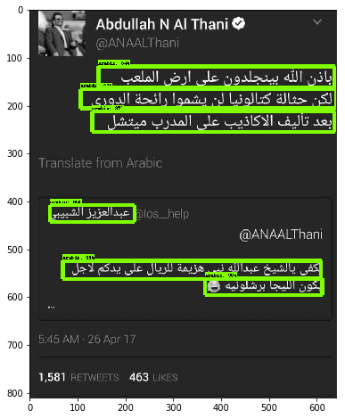

# Experiment to Detect Arabic Text in Images and Convert to Text for Translation



A GPU is required for training the Arabic detection models. 

## Required Arabic Datasets

[AcTiV-D](http://diuf.unifr.ch/diva/AcTiVComp/detect.html), a subset of non-redundant frames collected from the AcTiV-DB and used to measure the performance of single-frame based methods to locate/detect text regions in still HD/SD images. AcTiV-D consists of 1843 frames (5133 textlines) distributed over four sets (one set per channel). Every set includes two sub-sets: trainingFiles and testFiles.

[AcTiV-R](http://diuf.unifr.ch/diva/AcTiVComp/recog.html), a subset of cropped text images created from the AcTiV-DB and used to evaluate the performance of Arabic text recognition systems (AOCR).

[ALIF](https://cactus.orange-labs.fr/ALIF/), 6,532 well-annotated Arabic text images extracted from Arabic TV channels.


## Optional Image Dataset

[Open Image](https://github.com/openimages/dataset), used to create synthetic training examples of images with Arabic text taken from AcTiV-R and ALIF above. The required file is [here](https://storage.googleapis.com/openimages/2017_11/images_2017_11.tar.gz)


## Download Pretrained Tensorflow Models for Transfer Learning

Faster RCNN Resnet50 [here](http://download.tensorflow.org/models/object_detection/faster_rcnn_resnet50_coco_2017_11_08.tar.gz)

(Optional)
Faster RCNN Inception v2 Coco [here](http://download.tensorflow.org/models/object_detection/faster_rcnn_inception_v2_coco_2017_11_08.tar.gz)

Other models available on [GitHub](https://github.com/tensorflow/models/blob/master/research/object_detection/g3doc/detection_model_zoo.md)
Matching config files for other models also available on [GitHub](https://github.com/tensorflow/models/tree/master/research/object_detection/samples/configs)

## Build Docker Container for Detecting Arabic in Images 

```
docker build -f Dockerfile.arabic_detection -t hammer.arabic_detection .
```

## Run Docker Container for Detecting Arabic in Images

Notes: 
- Port 8888 opened for Jupyter
- Port 6006 opened for tensorboard (optional)
- The AcTiV-D, AcTiV-R, ALIF and Open Image dataserts should all be located in /path/to/arabic_text/ 
- The pretrained Tensorflow models should be located in /path/to/pretrained/models/

```
nvidia-docker run -p 8888:8888 -p 6006:6006 -v /path/to/arabic_text:/arabic_text -v /path/to/pretrained/models/:/prog/models/model/pretrained hammer.arabic_detection
```

## Inside Docker Container

#1. Open Terminal in Jupyter and Untar Pretrained Model
```
cd /prog/models/model/
tar xvzf pretrained/faster_rcnn_resnet50_coco_2017_11_08.tar.gz
```

#2. Black out Ticker for France24 and Al-Jaeera Collections in AcTiV-D dataset 
```
cd /prog
python3 preprocess_activ.py --remove_ticker
```

If you want to generate synthetic examples, run
```
python3 preprocess_activ.py --generate_data
``` 

#3. Parse AcTiV Data
```
python3 parse_activ.py
```

#4. (Optional) Start Tensorboard
```
tensorboard --logdir /prog/models/model/eval
```

#5. Start Training
```
python3 object_detection/train.py --logtostderr --pipeline_config_path=/prog/models/model/faster_rcnn_resnet50_coco.config --train_dir=/prog/models/model/train
```

#6. (Optional) Start Evaluation
```
python3 object_detection/eval.py --logtostderr --pipeline_config_path=/prog/models/model/faster_rcnn_resnet50_coco.config --checkpoint_dir=/prog/models/model/train --eval_dir=/prog/models/model/eval
```

Note: GPU may run out of memory if attempting Train and Eval in parallel on the same GPU. Send eval to CPU by including the following line at the beginning of eval.py:
```
import os
os.environ["CUDA_VISIBLE_DEVICES"]=""
```

#7. Export Model After Training
```
python3 object_detection/export_inference_graph.py \
    --input_type image_tensor \
    --pipeline_config_path /prog/models/model/faster_rcnn_resnet50_coco.config \
    --trained_checkpoint_prefix /prog/models/model/train/model.ckpt-200000 \
    --output_directory /prog/models/exported/
```

#8. Test Images in Jupyter Notebook

In Jupyter, open /prog/object_detection_tutorial.ipynb and step through the cells

#9. (Optional) Train a Faster RCNN Inception Model

```
python3 object_detection/train.py --logtostderr --pipeline_config_path=/prog/models/model/faster_rcnn_inception_v2_coco.config --train_dir=/prog/models/model/train

python3 object_detection/eval.py --logtostderr --pipeline_config_path=/prog/models/model/faster_rcnn_inception_v2_coco.config --checkpoint_dir=/prog/models/model/train --eval_dir=/prog/models/model/eval

python3 object_detection/export_inference_graph.py \
    --input_type image_tensor \
    --pipeline_config_path /prog/models/model/faster_rcnn_resnet50_coco.config \
    --trained_checkpoint_prefix /prog/models/model/train/model.ckpt-200000 \
    --output_directory /prog/models/exported/
```


